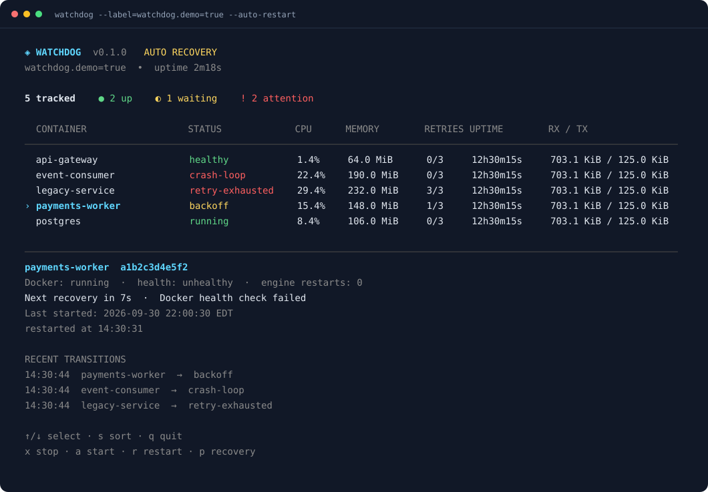

# Docker Watchdog

A Go terminal dashboard that monitors Docker containers, detects crash loops, and restarts unhealthy containers with backoff and retry limits.



*Example dashboard using illustrative data.*

## Features

- Live CPU, memory, network, and health monitoring with keyboard navigation.
- Confirmed start, stop, restart, and per-container recovery controls.
- Concurrent container workers with a shared Docker API concurrency limit.
- Automatic recovery with capped retries and crash-loop detection.
- SQLite-backed retry budgets and incident history that survive restarts.
- JSON logs, a read-only HTTP API, and Prometheus-compatible metrics.

## Getting started

Requires **Go 1.26+** and a running **Docker Engine or Docker Desktop with Linux containers**.

From the project directory:

```sh
go run ./cmd/watchdog
```

The dashboard opens automatically in a terminal. **Automatic recovery is off by default.** State refreshes every 3 seconds, with discovery every 5 seconds. Manual actions require confirmation.

To build a binary:

```sh
go build -o bin/watchdog ./cmd/watchdog
./bin/watchdog
```

On Windows, build with `-o bin/watchdog.exe` and run `.\bin\watchdog.exe`.

## Enable recovery

Select containers by label and opt into automatic restarts:

```sh
go run ./cmd/watchdog --label=watchdog.enable=true --auto-restart
```

Containers need a Docker health check for health-based recovery. The default limit is **3 attempts**, with exponential backoff. Five minutes of continuous healthy/running observations resets the budget.

Watchdog leaves recovery to Docker when a container already has a restart policy. Add `--recover-exited` to also recover previously tracked containers that exit nonzero; this can include external manual stops.

## Try the demo

The included Compose stack has healthy, unhealthy, crash-looping, and unexpectedly exiting containers.

- **Linux / macOS:** `make demo`
- **PowerShell:** `.\scripts\demo.ps1`

The demo enables recovery only for containers labeled `watchdog.demo=true`. Quit with `q`, then clean up:

```sh
docker compose -p watchdog-demo --profile service down
```

## Controls

| Key | Action |
| --- | --- |
| `↑` / `↓` or `k` / `j` | Select container |
| `PgUp` / `PgDn` | Scroll |
| `s` | Sort by name, CPU, or memory |
| `x` / `a` / `r` | Stop / start / restart selected container |
| `p` | Pause / resume automatic recovery for selected container |
| `q` / `Ctrl+C` | Quit |

Confirm actions with `y`; cancel with `n` or `Esc`. Stopping through Watchdog saves a recovery pause so it stays stopped across Watchdog restarts. A successful start/restart resumes recovery if globally enabled, preserving the retry budget. `p` keeps monitoring active; it does not pause the container itself.

Successful Watchdog stops show `stopped`, including forced stops with a nonzero exit code. External nonzero exits still show `crashed`; polling cannot reliably identify stops made in another app.

## Logs and API

```sh
go run ./cmd/watchdog --output=json
```

The local API runs at `http://127.0.0.1:9780`:

- `/api/containers` — current observations
- `/api/events` — incident history
- `/metrics` — Prometheus metrics
- `/healthz` — process/storage liveness

Use `--help` for options. See the [technical reference](docs/reference.md) for recovery rules, configuration, Docker deployment, API details, and development commands.

## License

[MIT](LICENSE) © 2026 Espiobest.
