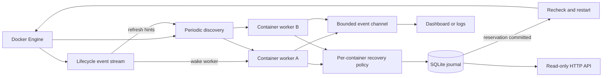

# Technical reference

[Back to the README](../README.md)

## How recovery works



1. Discovery lists containers matching the optional label. The dashboard includes stopped containers for manual controls; log/service mode adopts running/restarting containers and retains their workers when they stop. With exit recovery enabled, previously tracked exited containers can also be restored from the journal. Merely discovering a stopped container does not make it eligible for automatic exit recovery.
2. A worker inspects its container and fetches a bounded, non-streaming stats response. The shared semaphore limits simultaneous Docker operations.
3. The policy classifies Docker lifecycle and health separately from watchdog assessments such as `backoff` and `retry-exhausted`. It observes new starts to detect loops and interrupt the stable-health timer.
4. An eligible failure first waits 5 seconds. Subsequent cooldowns are 10, 20, 40 seconds, up to the configured maximum. Only three attempts are allowed by default.
5. Before each restart, the worker commits its retry reservation to SQLite. It then rechecks the container to avoid acting on a stale observation and calls Docker's restart API with a 10-second stop grace period.
6. Failed and timed-out recovery requests consume attempts too. A timeout does not prove Docker did nothing. Cooldown begins after the request completes.
7. The retry budget resets only after 5 minutes of continuously observed healthy/running state without new starts. Watchdog downtime does not count toward that period.

### Recovery rules and limits

- **Automatic recovery is off by default.** `--auto-restart` enables automatic restarts. Dashboard actions are available independently and require confirmation.
- **Exit recovery is separate.** `--recover-exited` permits recovery of previously observed containers that exit nonzero. Clean exits remain stopped. An external manual stop can produce a nonzero exit; polling cannot reliably distinguish that from a crash.
- **Paused, removing, dead, and health-starting containers are not restarted.** A crash-loop alert alone does not kill a currently healthy process.
- **Docker restart policies take precedence.** Watchdog does not restart containers configured with `always`, `unless-stopped`, or `on-failure`, including unhealthy ones. Docker itself generally responds to exits, not health-check failures; use restart policy `no` if Watchdog should own recovery.
- **Read errors do not imply unhealthy.** Failed inspections produce `unknown`; stats failures do not erase known health. Discovery failures retain existing workers and budgets.
- **Storage failures block recovery.** An uncommitted reservation never leads to a restart request. An OS lock prevents two watchdogs from opening the same journal, including across SQL connection replacement.
- **One controller per container set.** Different database files do not coordinate ownership. Avoid running multiple watchdog processes against overlapping labels.
- **Polling has limits.** Very short-lived containers can appear and disappear between discoveries. Historical restarts before the first observation are not automatically classified as a new crash loop.
- **No exactly-once claim.** If the process dies during an API request, the reserved attempt remains spent even if the request never reached Docker. This favors preventing restart storms.

## Manual dashboard controls

Select a container, press `x` (stop), `a` (start), `r` (restart), or `p` (toggle automatic recovery), then confirm with `y`. The confirmation pins the full container ID. Commands run through that container's worker, sharing the API limit and serializing with automatic recovery.

Before stop/start/restart, Watchdog persists a recovery pause. Storage failure prevents the Docker request; failed or timed-out requests leave recovery paused. A successful start/restart resumes automatic recovery when globally enabled, preserves attempts, and starts a fresh cooldown. Stop keeps recovery paused across process restarts. This setting controls Watchdog only, not Docker's own restart policy.

Monitoring continues while recovery is paused. `p` does not invoke Docker pause/unpause. Container removal and exec are not implemented; the HTTP API remains read-only.

## Live container logs

`l` opens a read-only log view for the selected full container ID, requests the latest 200 lines, and follows new output. Non-TTY stdout/stderr are demultiplexed using the Docker SDK's stream format; TTY output is a combined stream. Docker timestamps are retained. ANSI escapes and control characters are removed before rendering.

The UI retains 500 lines/chunks, with a 64-entry producer queue and bounded batches. Long lines are split around 4 KiB on UTF-8 boundaries (at most 4,099 bytes per chunk), and displayed lines are clipped to terminal width. Logs are not persisted in SQLite. A logging driver must support Docker's logs API; failures appear in the log view.

Use arrows/`PgUp`/`PgDn` to scroll, `Home` to reach the oldest retained output, and `f`/`End` to follow the tail. `Esc`, `l`, or `q` closes the view and cancels its stream; `Ctrl+C` quits Watchdog. `r` reconnects and reloads recent output, including after a container exits or restarts. Container actions are available after returning to the dashboard. Monitoring continues while logs are open.

## Docker lifecycle events

One label-filtered Docker event stream runs alongside periodic polling. Lifecycle and health events enqueue refresh hints for the owning worker and batch discovery within 100 ms. The worker still inspects actual state and applies the same recovery policy; events never mutate policy or issue recovery directly. A busy worker handles the hint after its current operation.

Connection errors are visible in logs and the dashboard. Reconnect delays increase from 1 second to a maximum of 30 seconds, resetting after a connection lasts a minute. Each successful connection triggers reconciliation and worker refreshes. There is no event replay or exactly-once delivery guarantee: a bounded hint queue coalesces/drops excess hints, while scheduled polling/discovery catch current state. Short-lived intermediate states can still be missed, and events do not establish who intended a stop.

Log and event streams have five-second connection setup deadlines and cancellation-driven shutdown. Their long-lived connections do not occupy the semaphore used for polling and mutations. A dashboard opens one log view at a time; closing/reconnecting cancels the previous subscription.

## HTTP API

The API is read-only and binds to loopback by default. It has request timeouts and no authentication; use an authenticated reverse proxy if you expose it beyond the local machine.

| Endpoint | Returns |
| --- | --- |
| `GET /healthz` | Process/storage liveness, **not** a guarantee of Docker connectivity |
| `GET /api/containers` | Latest observations from this watchdog run |
| `GET /api/events?limit=100` | Newest incident records first |
| `GET /api/events?container=FULL_ID&before=SEQUENCE&limit=50` | Filtered history with cursor pagination |
| `GET /metrics` | Container count, recovery attempts, CPU, memory, and observation timestamps |

```sh
curl http://127.0.0.1:9780/api/containers
curl 'http://127.0.0.1:9780/api/events?limit=10'
curl http://127.0.0.1:9780/metrics
```

PowerShell: use `Invoke-RestMethod http://127.0.0.1:9780/api/containers`.

History retains the latest **10,000 transitions/actions**, rather than every stats sample. `limit` must be 1–500; `before` is an exclusive event-sequence cursor. Current rows include timestamps so clients can detect stale data. Recovery-attempt metrics are gauges because stable recovery resets them.

## Service mode

Plain logs or JSON Lines work with systemd, containers, and log collectors:

```sh
./bin/watchdog --output=json --label=watchdog.enable=true --auto-restart
```

Run the included demonstration service in Docker:

```sh
docker compose -p watchdog-demo --profile service up --build -d
docker compose -p watchdog-demo logs -f watchdog
```

The service stores its journal in a named volume and exposes the API on host loopback. Do not run the local demo watchdog at the same time. The Docker socket grants control of the host's containers; the service requires that access to perform recovery.

## Configuration

Run `watchdog --help` for every flag. Frequently used options:

| Flag | Default | Purpose |
| --- | --- | --- |
| `--output` | `auto` | Dashboard in a terminal, otherwise logs; also accepts `table`, `logs`, `json` |
| `--label` | all | Limit discovery to a Docker label |
| `--auto-restart` | false | Enable health recovery |
| `--recover-exited` | false | Include previously observed nonzero exits |
| `--interval` | `3s` | Poll interval per container |
| `--discovery-interval` | `5s` | Find new/removed containers |
| `--concurrency` | `8` | Maximum concurrent Docker operations |
| `--backoff` / `--max-backoff` | `5s` / `1m` | Initial and maximum recovery delays |
| `--max-retries` | `3` | Attempts before recovery is suspended |
| `--stable-reset` | `5m` | Continuous good health before retry reset |
| `--crash-threshold` / `--crash-window` | `3` / `1m` | Repeated-start detection |
| `--db` | `watchdog.db` | Durable journal file |
| `--listen` | `127.0.0.1:9780` | HTTP address; `--listen=` disables it |
| `--host` | SDK default | Docker endpoint override |
| `--run-for` | `0` | Optional duration before graceful exit |

`DOCKER_HOST`, `DOCKER_TLS_VERIFY`, and `DOCKER_CERT_PATH` are supported through the SDK. Docker CLI contexts are not automatically read. If the CLI works but Watchdog cannot connect, pass the context's endpoint explicitly:

```sh
./bin/watchdog --host="$(docker context inspect --format '{{.Endpoints.docker.Host}}')"
```

PowerShell:

```powershell
$dockerEndpoint = docker context inspect --format '{{.Endpoints.docker.Host}}'
.\bin\watchdog.exe --host=$dockerEndpoint
```

The SDK supports its native Unix socket, Windows named pipe, and TCP/TLS transports; SSH contexts require a separately configured tunnel.

## Development

```sh
go fmt ./...
go vet ./...
go run honnef.co/go/tools/cmd/staticcheck@v0.8.1 ./...
go test -race -cover ./...
go build ./cmd/watchdog
```

The race detector requires a C toolchain even though the application and SQLite driver build without CGO. CI runs formatting, vet, Staticcheck, tests with race detection, and a build on Linux.

```text
cmd/watchdog/          CLI options and process lifecycle
internal/watchdog/     Worker supervision, typed statuses, policy, checkpoints
internal/dockerengine/ Docker SDK transport and Linux stats conversion
internal/storage/      SQLite schema, atomic journal, process ownership lock
internal/httpapi/      Read-only HTTP routes and metrics
internal/tui/          Bubble Tea state/update loop and Lip Gloss rendering
internal/display/      Plain and JSON log output
scripts/               Demo and preview helpers
```

Tests cover backoff/caps, interrupted health resets, durable reservations, storage failures, cancellation under backpressure, worker lifecycle/concurrency, HTTP SDK behavior, database reopen/connection replacement, API validation, and terminal layout/keyboard behavior. Unit tests do not require Docker.
